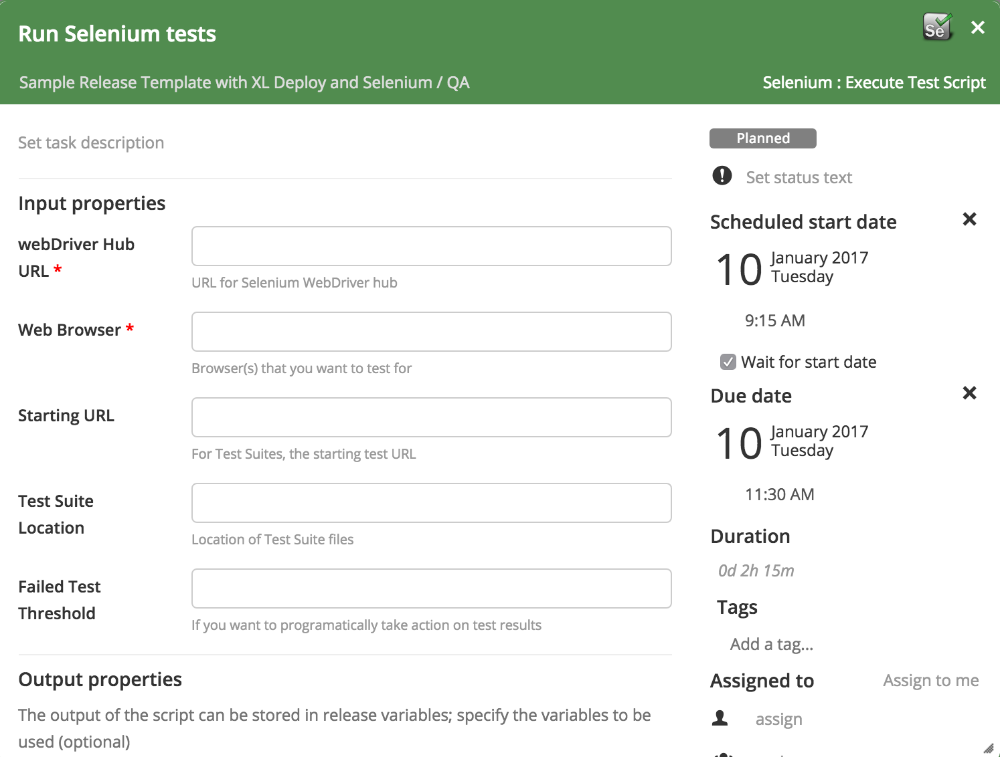
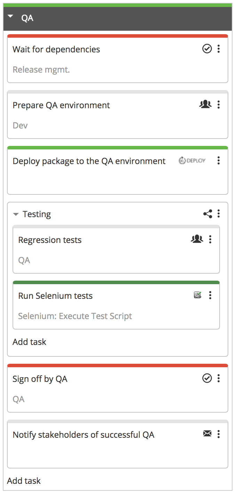

# xlr-selenium-plugin

[![License: MIT][xlr-selenium-plugin-license-image]][xlr-selenium-plugin-license-url]
[![Github All Releases][xlr-selenium-plugin-downloads-image]]()

[xlr-selenium-plugin-license-image]: https://img.shields.io/badge/License-MIT-yellow.svg
[xlr-selenium-plugin-license-url]: https://opensource.org/licenses/MIT
[xlr-selenium-plugin-downloads-image]: https://img.shields.io/github/downloads/xebialabs-community/xlr-selenium-plugin/total.svg

# XL Release Selenium Plugin

## Preface
This document describes the functionality provide by the `xlr-selenium-plugin`

## Overview
This module offers a basic interface to Selenium functionality.

## Installation
1. Copy the plugin JAR file into the `SERVER_HOME/plugins` directory of XL Release.

2. The Selenium plugin requires XL Release access to [Selenium WebDriver](http://www.seleniumhq.org/projects/webdriver/).  Once you have downloaded Selenium WebDriver, you must add the python classes to the <XL_RELEASE>/lib/jython-standalone-2.7.0.jar by running the following command:

`zip -u -r jython-standalone-2.7.0.jar Lib/*`
## Available Tasks

### Create Selenium task type

The **Selenium: Execute Test Script** task type runs Selenium test scripts. It requires you to specify the following information:

* URL for WebDriver Hub 
* The web browser that you want to test with

Additionally, for testing with Selenium Test Suites, you can specify:

* Starting URL
* Location of Test Suite Files
* Integer representing a threshold for failed test cases

## XL Release Scenario

Customers generally invoke Selenium testing during the Continuous Integration phase of building code, using their CI tool to run Selenium testing for Developers to validate their code changes.

These same Selenium tests can be run in different environments.  A sample XL Release template shows how QA can leverage the automated Selenium tests as part of their overall testing effort 

--- 

## References:
* [Selenium WebDriver](http://www.seleniumhq.org/projects/webdriver/)
